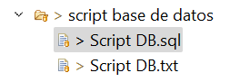
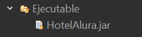
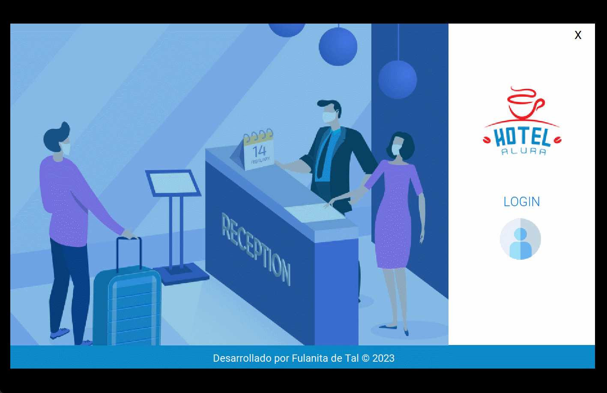
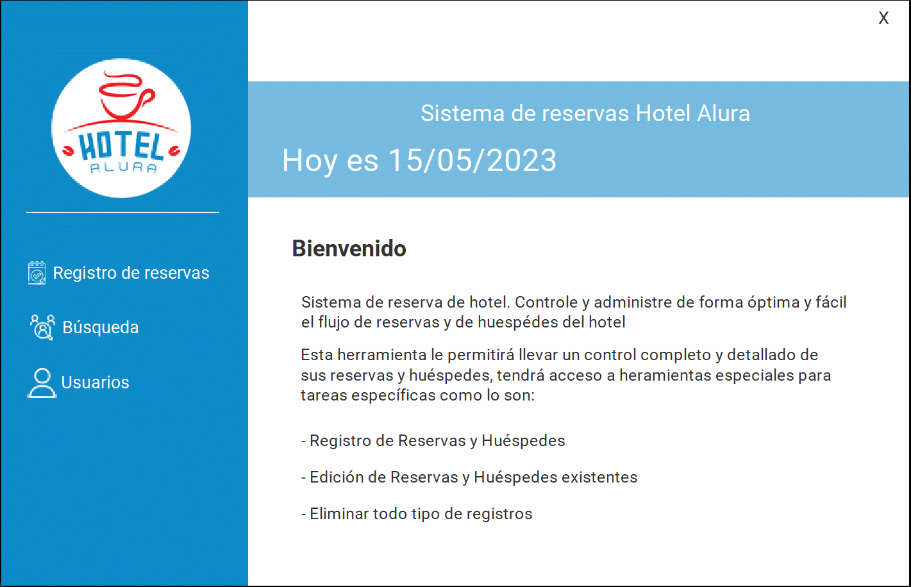
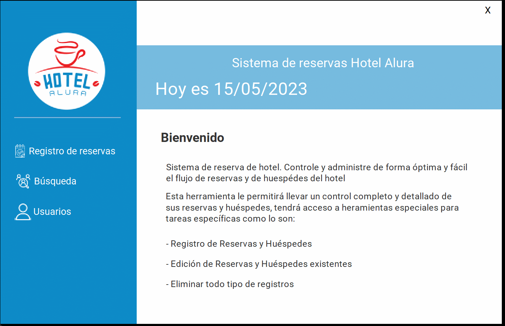
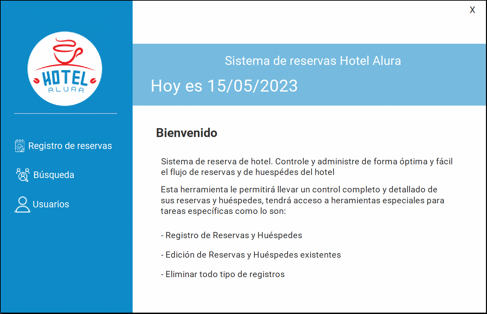

# Challenge ONE | Java | Back-end | Hotel Alura

     

---
##  📋 Índice
#### 🔹 [Descripción del proyecto](#descripcion)
#### 🔹 [Script base de datos](#script)
#### 🔹 [Ejecutable](#ejecutable)
#### 🔹 [Funcionalidades](#funcionalidades)
#### 🔹 [Tecnologías utilizadas](#tecnologiasUtilizadas)
#### 🔹 [Desarrollador](#desarrollador)

---
## 📑 Descripción del proyecto
Aplicación de escritorio para hotel que permite crear empleados, crear reservas, huespedes y calcula el valor que se tiene que pagar por el hospedaje. Cuenta con una pestaña de busqueda donde se pueden consultar las reservar, los huespedes, los usuarios y se pueden editar o eliminar los registros.

---
## 📊 Script base de datos
Para crear la base de datos se utiliza MySql y se ejecuta el script de la carpeta 📁 Script base de datos.

     

---
## ⬇️ Ejecutable
Luego de ejecutar el script base de datos se puede probar el proyecto mediante el archivo .jar que está en la carpeta 📁 Ejecutable.

     

---
## 🎨 Funcionalidades

#### 🔹Inicio de sesión
Si ejecuto el script de de la carpeta 📁 Script base de datos, los datos de inicio de sesión por defecto son:
👤 usuario: admin 
⛔ contraseña: admin

     

 

#### 🔹Registro de usuarios
Botón usuario habilitado solo para perfiles con rol de Administrador.

     

 

#### 🔹Registro de reservas y huéspedes

     

 

#### 🔹Busquedas
Mediante el botón busqueda se pueden consultar, modificar y eliminar las reservas, huéspedes y usuarios.

     

 

---
## 🖥️ Tecnologías Utilizadas

🔹 Java
🔹 Eclipse
🔹 Biblioteca JCalendar
🔹 MySql
🔹 Plugin WindowBuilder  

---
## Desarrollador
💙 <strong>Edwin Córdoba</strong> 

