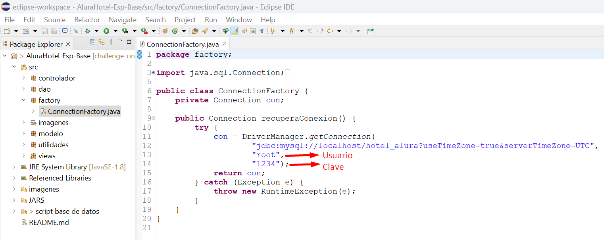
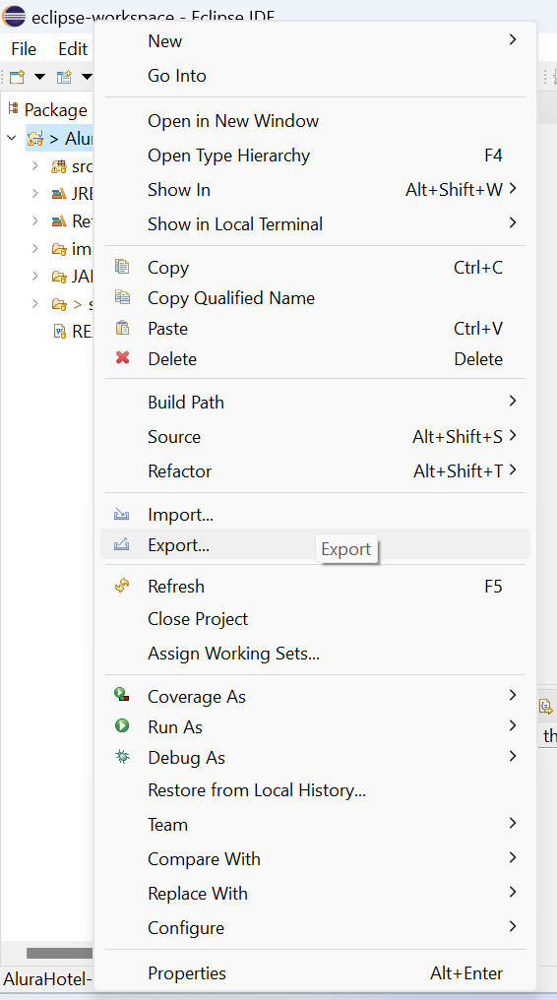
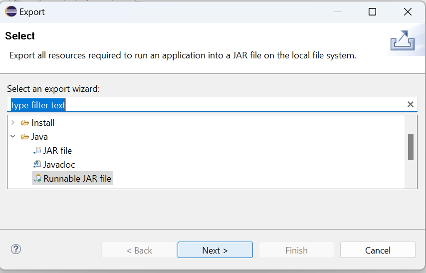
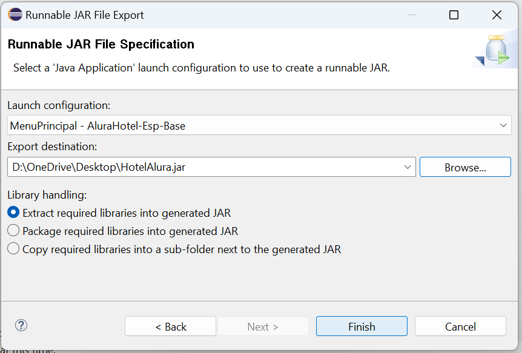

# Challenge ONE | Java | Back-end | Hotel Alura

     

 

---
##  📋 Índice
#### 🔹 [Descripción del proyecto](#descripcion)
#### 🔹 [Base de datos](#basededatos)
#### 🔹 [Ejecutable](#ejecutable)
#### 🔹 [Funcionalidades](#funcionalidades)
#### 🔹 [Tecnologías utilizadas](#tecnologiasutilizadas)
#### 🔹 [Desarrollador](#desarrollador)
 

---
## 📑 Descripción del proyecto
Aplicación de escritorio para hotel que permite crear empleados, crear reservas, huespedes y calcula el valor que se tiene que pagar por el hospedaje. Cuenta con una pestaña de busqueda donde se pueden consultar las reservar, los huespedes, los usuarios y se pueden editar o eliminar los registros.
 
 

---
## 📊 Base de datos
▪️ Para crear la base de datos instale MySql versión 8.0.32.
 
▪️ Configure el usuario y clave de la base de datos en el archivo src/factory/ConnectionFactory.java
 

     

 
▪️ Ejecuta el script de la carpeta 📁 Script base de datos.
   

     

 

---
## ⬇️ Ejecutable
Luego de ejecutar el script base de datos crear el ejecutable de la aplicación.

▪️ Clic derecho sobre el proyecto y luego clic en export.
 

     

 
▪️ Buscamos la carpeta Java, luego Runnable JAR file y damos clic en Next.
 

     

 
▪️ En Launch Configuration seleccionamos MenuPrincipal - AluraHotel-Esp-Base.
 
▪️ Luego en Export Destination seleccionamo la ruta donde queremos que se guarde el ejecutable.
 
▪️ Y por último damos clic en Finish.
 

     

 

---
## 🨠Funcionalidades

#### 🔹Inicio de sesión
Si ejecuto el script de la carpeta 📠Script base de datos, los datos de inicio de sesión por defecto son: 
👤 usuario: admin 
⛔ contraseña: admin

     

 

#### 🔹Registro de usuarios
Botón usuario habilitado solo para perfiles con rol de Administrador.

     

 

#### 🔹Registro de reservas y huéspedes

     

 

#### 🔹Búsquedas
Mediante el botón búsqueda se pueden consultar, modificar y eliminar las reservas, huéspedes y usuarios(Habilitado solo para Administrador).

     

 

---
## 🖥️ Tecnologías Utilizadas

🔹 Java 
🔹 Eclipse 
🔹 Biblioteca JCalendar 
🔹 MySql 
🔹 Plugin WindowBuilder  
 

---
## 💻 Desarrollador
👨‍💻 <strong>Edwin Córdoba</strong> 

